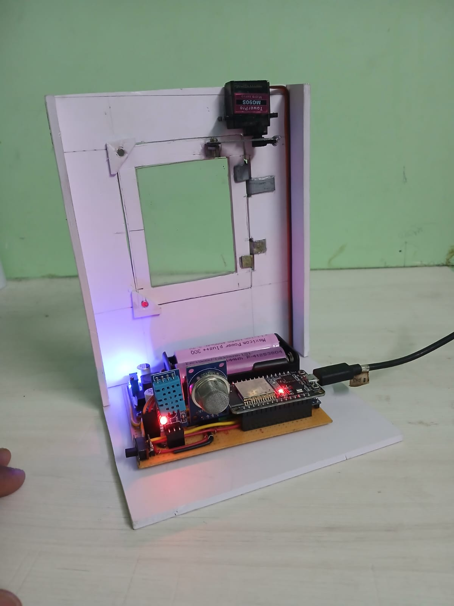

# IoT Enabled Automatic Window Opening System



An IoT-based smart window automation system developed using **ESP32, DHT11 temperature sensor, MQ135 air-quality sensor, servo motor, IR remote, and Blynk IoT platform**.

---

## 📌 Project Overview

The **IoT Enabled Automatic Window Opening System** automatically controls a window based on environmental conditions.

The ESP32 continuously monitors temperature and air quality using the **DHT11** and **MQ135** sensors. When the temperature or air-quality value exceeds a predefined threshold, the servo motor automatically opens the window to improve ventilation.

The system also supports remote monitoring and manual control through the **Blynk IoT platform** and an **IR remote**.

---

## ✨ Features

- 🌡️ Temperature monitoring using DHT11
- 🌫️ Air-quality monitoring using MQ135
- ⚙️ Automatic window opening using servo motor
- 📱 Remote monitoring using Blynk IoT
- 🎛️ Manual control through Blynk
- 📡 IR remote-based window control
- 🔄 Automatic and manual operating modes
- 🚪 Automatic ventilation based on environmental conditions

---

## 🛠️ Components Used

| Component | Purpose |
|---|---|
| ESP32 | Main microcontroller |
| DHT11 | Temperature measurement |
| MQ135 | Air-quality measurement |
| Servo Motor | Opens and closes the window |
| IR Receiver | Receives IR remote commands |
| IR Remote | Manual window control |
| Wi-Fi | Internet connectivity |
| Blynk IoT | Remote monitoring and control |

---

## 🔌 Pin Configuration

| Component | ESP32 Pin |
|---|---:|
| DHT11 Data | GPIO 4 |
| MQ135 Analog Output | GPIO 34 |
| Servo Motor | GPIO 18 |
| IR Receiver | GPIO 15 |

---

## ⚙️ Working Principle

1. The ESP32 starts and connects to Wi-Fi.
2. The ESP32 connects to the Blynk IoT platform.
3. The DHT11 measures the surrounding temperature.
4. The MQ135 measures the air-quality level.
5. The ESP32 compares the sensor values with predefined thresholds.
6. If the temperature or air quality exceeds the threshold, the servo opens the window.
7. Otherwise, the window remains closed.
8. The user can also control the window manually through Blynk or an IR remote.

---

## 📱 Blynk IoT Controls

| Virtual Pin | Function |
|---|---|
| V0 | Open Window |
| V1 | Close Window |
| V2 | Display Temperature |
| V3 | Auto/Manual Mode |
| V4 | Display Air Quality |

---

## 🎛️ IR Remote Control

| IR Command | Function |
|---:|---|
| 90 | Open Window |
| 8 | Close Window |

---

## 📊 System Thresholds

```text
Temperature Limit = 30 °C
Air Quality Limit = 600
